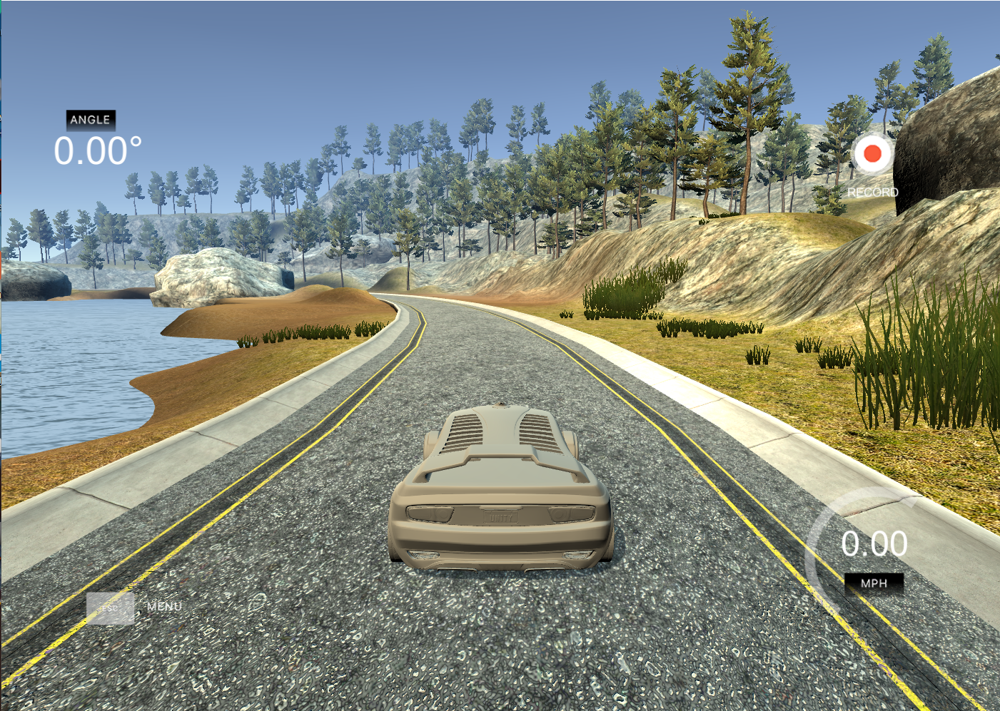
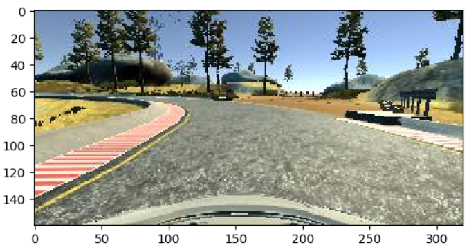
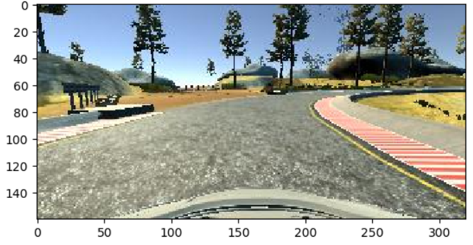
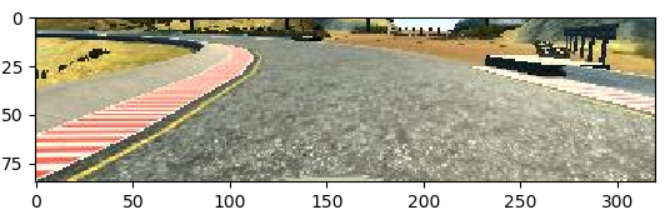
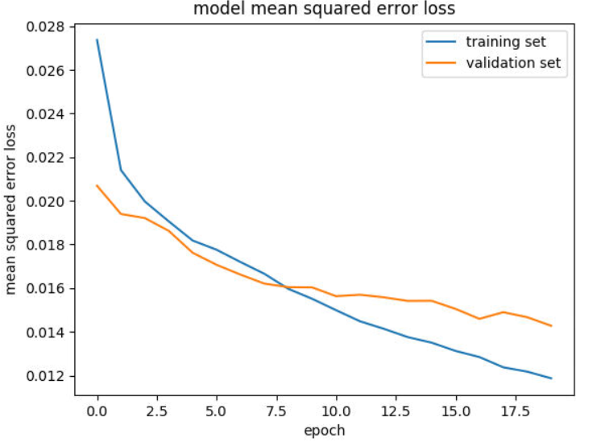

# Behavioral Cloning Project
<p align="center">
  
</p>
## Overview
This repository contains files for the Behavioral Cloning Project.

In this project, a deep neural network is applied to clone driving behavior. The model is trained, validated and tested using Keras. The model will output steering angle to an autonomous vehicle regarding current input camera image.

A simulator is provided where you can steer a car around a track for data collection. Later, these image data and steering angles is used to train a neural network and then use this model to drive the car autonomously around the track.


## The Project Dependecy
* Python >= 3.6
* Tensorflow >= 1.4.0
* Numpy >= 1.18.0
* Matplotlib >= 3.1.1
* Opencv >= 4.2.0
* Scipy >= 1.3.1
* Sklearn >= 0.22


## Details About Files In This Directory

### `train.py`

Script used to processe data and train the model

### `drive.py`

Script to drive the car using neural network. Load the trained neural network "model.h5" with simulator using this command:

```sh
python drive.py model.h5
```

The above command will use the model to make predictions on individual images in real-time and send the predicted angle back to the simulator via a websocket connection.


### `video.py`

Creates a video based on recorded images.

### `model.h5`

A trained Keras model


## Project Pipline

### 1. Data Collection:

To ensure a good predicion from neural network, the training data must be collected carefully. 

* The car should stay in the center of the road as much as possible
* If the car veers off to the side, it should recover back to center

At each time stamp the following data can be collected:

| Image         | Steering Angle| Throttle |
| ------------- |:-------------:| --------:|
| \right_2020_06| -0.1          | 0.0353595|


### 2. Data Preprocessing

At each timestamp, a image will be collected using front camera. 

<p align="center">
  
</p>

By using data augumentation and also avoid biased data, we can flipp the image to enrich dataset by twice (flipp the measurement value). 

The flipped image:
<p align="center">
  
</p>

```
for line in batch_samples:
    current_steerings = [float(line[3]), float(line[3]) + correction, float(line[3]) - correction]
    for i in range(3):
        name = '/opt/carnd_p3/data/IMG/' + line[i].split('/')[-1]
        img = ndimage.imread(name)
        images.append(img)
        measurements.append(current_steerings[i])
        image_flipped = np.fliplr(img)
        images.append(image_flipped)
        measurements.append(-current_steerings[i])
 ```          
 
A lambda layer is a convenient way to parallelize image normalization. The lambda layer will also ensure that the model will normalize input images when making predictions.:

```
model.add(Lambda(lambda x: x / 255 - 0.5, input_shape = (160, 320, 3)))
```

The Cropping2D layer might be useful for choosing an area of interest that excludes the sky and/or the hood of the car.

The cropped image:
<p align="center">
  
</p>

```
model.add(Cropping2D(cropping=((50, 20), (0, 0))))
```

### 3. Neural Network

Use Keras to train a network to do the following: 

* Take in an image from the center camera of the car. This is the input to the neural network. 
* Output a new steering angle for the car.

The final model consists of several conv2d, maxpooling2d, and dense layers. At the beginning of network, a lambda and a cropping2d layer are included for image normalization and cropping. Also, the activation function "relu" is chosen for all layers.

```
model.add(Convolution2D(32, 5, activation='relu'))
model.add(MaxPool2D(3, 3))
model.add(Convolution2D(64, 5, activation='relu'))
model.add(MaxPool2D(3, 3))
model.add(Convolution2D(128, 5, activation='relu'))
model.add(MaxPool2D(3, 3))
model.add(Dropout(0.5))
model.add(Flatten())
model.add(Dense(128, activation='relu'))
model.add(Dense(64, activation='relu'))
model.add(Dense(32, activation='relu'))
model.add(Dense(1))
```

Also, another solution using transfer training is provided, where we can use more powerful pre-trained model from other people to do the job. Here is an example using pre-built inception model in keras.

```
inception = InceptionResNetV2(include_top=False, weights = "imagenet")
# Freeze the training weights
for layer in inception.layers:
    layer.trainable = False
model0 = Model(inputs = inception.input, outputs = inception.get_layer('activation_2').output)
model0.add(Flatten())
model0.add(Dense(128, activation='relu'))
model0.add(Dense(64, activation='relu'))
model0.add(Dense(32, activation='relu'))
model0.add(Dense(1))
```

Training the neural network using adam optimizer:

```
model.compile(loss='mse', optimizer='adam')

history = model.fit_generator(train_generator, steps_per_epoch = np.ceil(len(train_samples)/batch_size), validation_data = validation_generator, validation_steps= np.ceil(len(validation_samples)/batch_size), epochs = 20, verbose = 2, callbacks=[checkpoint])
```

Plot the training history:
```
plt.plot(history.history['loss'])
plt.plot(history.history['val_loss'])
plt.title('model mean squared error loss')
plt.ylabel('mean squared error loss')
plt.xlabel('epoch')
plt.legend(['training set', 'validation set'], loc='upper right')
plt.show()
```
<p align="center">
  
</p>
